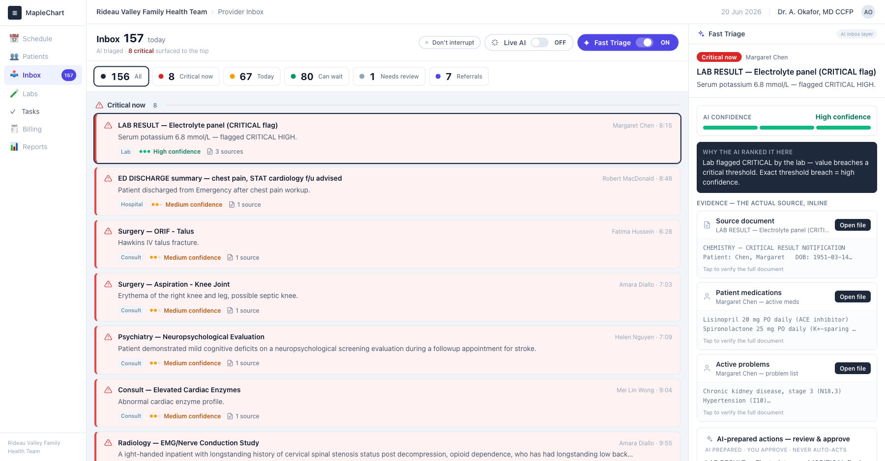
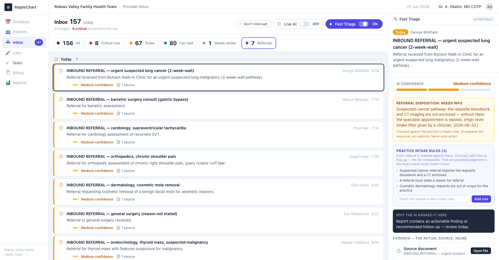

# Fast Triage

### The EMR inbox that thinks before you do.

An **LLM-powered AI workflow layer embedded inside the primary-care EMR inbox.** It reads every incoming message, decides what matters, drafts what comes next — and triages inbound referrals against each clinic's own intake rules.

> Built and clinician-validated on event day at the **AI in Healthcare Co-Design Hackathon** (June 20, 2026, Invest Ottawa). Synthetic data only.



---

## The problem

A doctor we sat with faces **~150 messages a day** in one EMR panel — labs, faxes, hospital reports, referrals — in arrival order, no filtering, worked through one by one. *"If you don't get to message 149, you just don't get to it."* Miss a critical result and you're liable. His real example: a patient's results sat **unseen for 10 days** because the responsible doctor was away and no system caught it.

The inbox *moves* information. It has never *understood* it.

## What it does

Fast Triage gives every message the three things the inbox never has:

- **A disposition** — *Critical now / Today / Can wait* — so the dangerous result is at the top, not buried at #149.
- **Its evidence** — the **actual source document, inline**, one tap away, with a confidence level. You verify, edit, override. It never acts on its own.
- **An action** — for an abnormal result it ties the value to the patient's medications and drafts the patient message *and* the follow-up task for one-click approval, with a full audit trail.

### The hard part nobody has solved: referrals

Fast Triage triages **inbound referrals** against the practice's *own* intake rules — *Needs info / Accept / Redirect*. A suspected-cancer referral missing its required bloodwork and CT is caught **on arrival**, with a same-day request drafted to the sender — instead of bouncing back declined 10 days later. Clinicians add new rules as they go; the rule set **compounds**.



**Why it's defensible:** those intake rules aren't written down anywhere — they live in doctors' heads and differ by clinic. A general LLM guesses; Fast Triage makes the rules explicit, human-approved, and accumulating. That per-clinic knowledge is a moat a base model will never have — and because every rule is approved by a person, it improves *without* becoming a black box.

---

## Run it locally

```bash
npm install
npm run dev        # http://localhost:5173
```

In the app: click **Turn on Fast Triage** to flip the raw inbox into the stratified queue, open a message to see its disposition + evidence + drafted action, and use the **Referrals** filter to see inbound-referral triage.

**Optional live LLM:** copy `.env.example` to `.env` and set `OPENROUTER_API_KEY` to route the drafting through Claude. Without a key, the deterministic engine runs everything — so the demo is rock-solid offline.

```bash
npm test           # 18 unit tests (the triage + referral rule engines)
npm run build      # tsc + production build → dist/
```

## How it's built

- **Stack:** React + Vite + TypeScript + Tailwind. Single `npm run dev`, no backend required.
- **Engine:** LLM reasoning (Claude via OpenRouter) over a **deterministic core**, so the rule that fires *is* the reasoning shown to the clinician — explainable, testable, never a black box.
- **Safety & privacy:** **synthetic data only** (Synthea / MTSamples / Health Canada DPD–shaped fixtures). No real patient data, no live EMR. Every action is human-approved; the system biases to *ask the human*, never a silent decline.
- **Feasibility:** text-in/text-out and FHIR-shaped — realistically deployable in 6–12 months.

## What's in this repo

| File | What it is |
|---|---|
| **[`DESIGN.md`](DESIGN.md)** | The design + build journey: clinician interviews, the locked architecture, the referral-intelligence spec, and the self-learning roadmap. |
| `src/engine/` | The deterministic triage + referral intake-rule engines (with tests). |
| `src/components/` | The embedded EMR shell, the triaged inbox, and the evidence/approval panel. |

---

*Fast Triage — the inbox that finally thinks before you do.*
